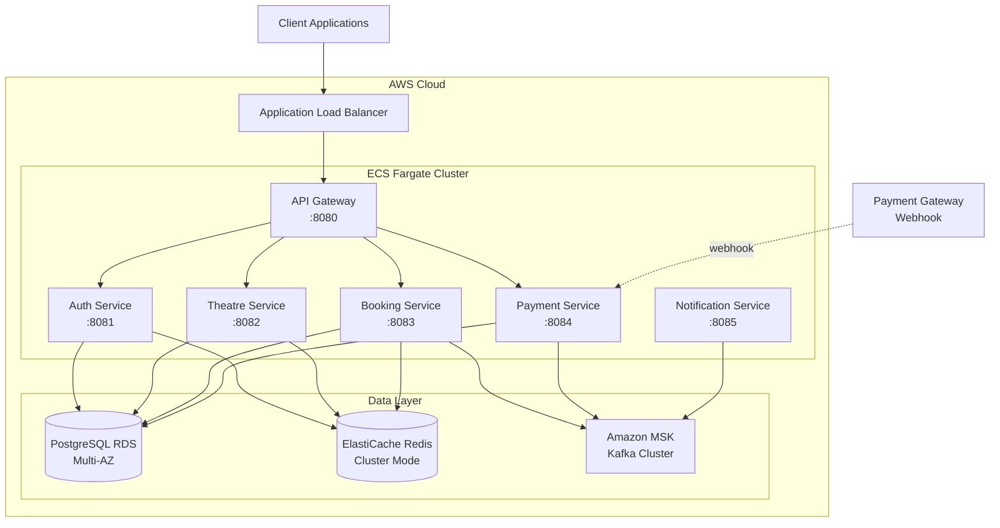
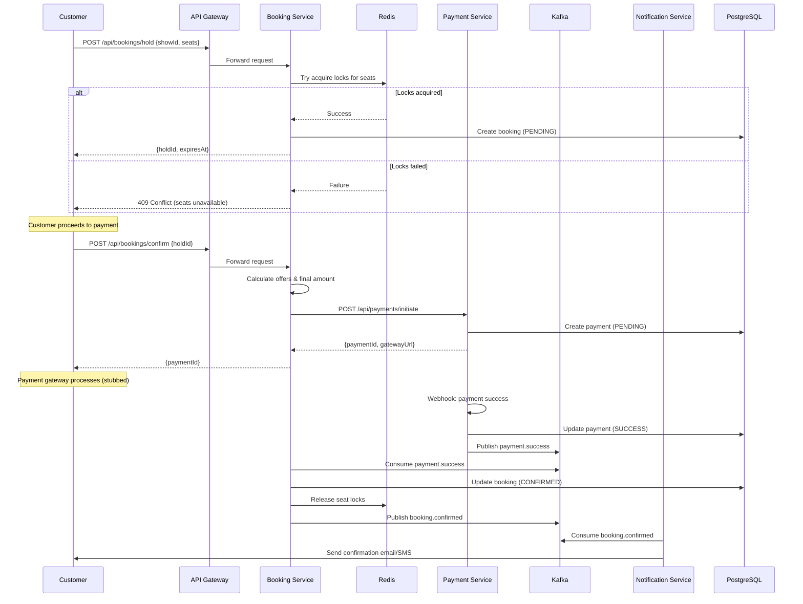
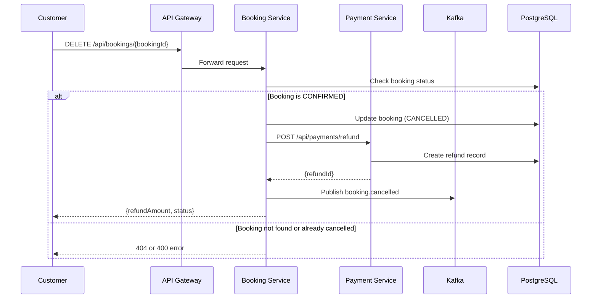
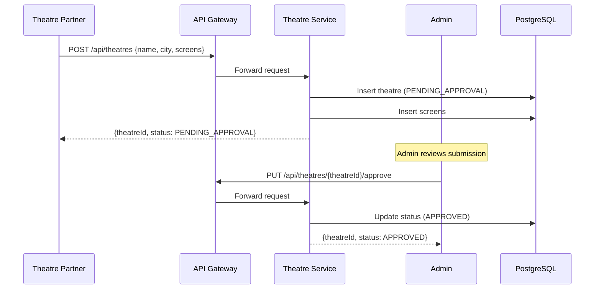
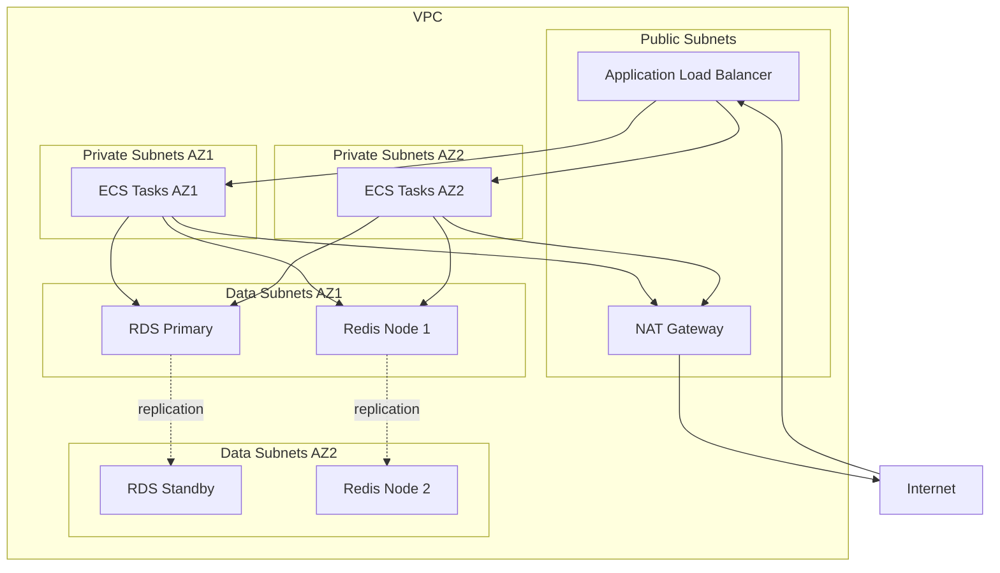

# XYZ Movie Booking Platform — Design Document

## 1. Overview

The XYZ Movie Booking Platform is a distributed microservices-based system for online movie ticket booking. It serves two primary client types: B2B theatre partners who manage their venues and shows, and B2C customers who browse and book tickets.

The platform is built using Java 17 and Spring Boot 3.x with a microservices architecture deployed on AWS ECS Fargate. Services communicate synchronously via REST APIs and asynchronously via Apache Kafka for event-driven workflows. Data persistence uses PostgreSQL for transactional data and Redis for caching and distributed locking.

Key capabilities:
- Theatre partner onboarding and show management
- Real-time seat availability with distributed locking
- Concurrent booking handling with strong consistency guarantees
- Flexible offer engine with multiple discount strategies
- Payment processing with webhook integration
- Asynchronous notifications via Kafka
- Multi-AZ deployment for high availability

---

## 2. Architecture

### 2.1 Microservices Overview

| # | Service | Responsibility | Port | Availability | Consistency Model |
|---|---|---|---|---|---|
| 1 | api-gateway | Routing, JWT filter, rate limiting | 8080 | 99.99% | Stateless (N/A) |
| 2 | auth-service | Registration, login, JWT, roles | 8081 | 99.99% | Eventual (Redis cache) |
| 3 | theatre-service | Theatre, screen, show, seat, inventory CRUD | 8082 | 99.95% | Eventual (Read-heavy) |
| 4 | booking-service | Seat hold, confirm, cancel, offers, bulk ops | 8083 | 99.99% | **Strong** (No double booking) |
| 5 | payment-service | Payment initiation, webhook, refund (stubbed) | 8084 | 99.95% | Eventual (Async events) |
| 6 | notification-service | Kafka consumer → email/SMS async | 8085 | 99.9% | Eventual (Best effort) |

### 2.2 Service Availability & Consistency Guarantees

#### 2.2.1 Availability Targets

**High Availability Services (99.99%)**:
- **API Gateway**: Single entry point, must be always available
- **Auth Service**: Authentication required for all operations
- **Booking Service**: Core business function, revenue-critical

**Standard Availability Services (99.95%)**:
- **Theatre Service**: Read-heavy, can tolerate brief outages
- **Payment Service**: Webhook retries handle temporary failures

**Best Effort Services (99.9%)**:
- **Notification Service**: Non-critical, can be delayed

#### 2.2.2 Consistency Models by Service

**Strong Consistency (CP - Consistency + Partition Tolerance)**:

**Booking Service** - CRITICAL for preventing double booking
```java
// Redis distributed locks ensure atomicity
@Service
public class SeatLockService {
    public boolean acquireLock(UUID showId, String seatNumber, UUID userId) {
        String lockKey = "seat:lock:" + showId + ":" + seatNumber;
        RLock lock = redissonClient.getLock(lockKey);
        
        // Atomic operation - only ONE thread can acquire
        boolean acquired = lock.tryLock(3, 600, TimeUnit.SECONDS);
        return acquired;
    }
}

// Database transaction with SERIALIZABLE isolation
@Transactional(isolation = Isolation.SERIALIZABLE)
public Booking confirmBooking(UUID holdId, UUID paymentId) {
    // Guarantees: At most ONE confirmed booking per seat
    // Trade-off: Slightly higher latency (< 500ms) for consistency
}
```

**Guarantees**:
- ✅ No double booking (business critical)
- ✅ Atomic seat lock acquisition
- ✅ Transactional booking confirmation
- ⚠️ Trade-off: Higher latency (< 500ms p99) vs eventual consistency

---

**Eventual Consistency (AP - Availability + Partition Tolerance)**:

**Auth Service** - Token validation with cache
```java
@Cacheable(value = "tokens", key = "#token", ttl = 900) // 15 min
public boolean validateToken(String token) {
    // Check blacklist first (strong consistency for revoked tokens)
    if (redisTemplate.hasKey("token:blacklist:" + token)) {
        return false;
    }
    
    // Validate signature (can use cached result)
    return jwtService.validate(token);
}
```

**Guarantees**:
- ✅ Fast authentication (< 50ms from cache)
- ⚠️ Revoked token might work for up to 15 minutes (mitigated by blacklist)
- ⚠️ User profile changes propagate within seconds

---

**Theatre Service** - Search with cache
```java
@Cacheable(value = "shows", key = "#city + #movie + #date", ttl = 60)
public List<ShowDTO> searchShows(String city, String movie, LocalDate date) {
    return showRepository.findByCityAndMovieAndDate(city, movie, date);
}

@CacheEvict(value = "shows", allEntries = true)
public void updateShow(Show show) {
    showRepository.save(show);
    // Cache cleared, next request fetches fresh data
}
```

**Guarantees**:
- ✅ Fast search (< 200ms with cache)
- ⚠️ Show availability cached for 60 seconds
- ⚠️ Might show slightly outdated show timings (acceptable for browse)

---

**Payment Service** - Webhook processing with retries
```java
@Transactional
public void processWebhook(PaymentWebhookEvent event) {
    Payment payment = paymentRepository.findById(event.getPaymentId())
        .orElseThrow();
    
    // Idempotent - safe to receive duplicate webhooks
    if (payment.getStatus() != PaymentStatus.PENDING) {
        return;
    }
    
    payment.setStatus(event.getStatus());
    paymentRepository.save(payment);
    
    // Publish to Kafka (eventual consistency)
    kafkaTemplate.send("payment.success", new PaymentSuccessEvent(payment));
}
```

**Guarantees**:
- ✅ Resilient to payment gateway failures (retries)
- ⚠️ Booking confirmation delayed by 1-5 seconds
- ✅ Idempotent webhook processing (safe for duplicates)

---

**Notification Service** - Best effort delivery
```java
@KafkaListener(topics = "booking.confirmed")
public void handleBookingConfirmed(BookingConfirmedEvent event) {
    try {
        notificationSender.send(event);
    } catch (Exception e) {
        log.error("Notification failed, will retry: {}", event.getBookingId());
        throw e; // Kafka will retry
    }
}
```

**Guarantees**:
- ✅ Doesn't block critical operations
- ⚠️ Notification might arrive late (acceptable)
- ✅ Automatic retries on failure

#### 2.2.3 CAP Theorem Trade-offs

| Service | CAP Choice | Reason | Trade-off |
|---|---|---|---|
| Booking Service | **CP** | No double booking > availability | Higher latency (< 500ms) |
| Auth Service | **AP** | Fast auth > perfect consistency | Stale cache (< 15 min) |
| Theatre Service | **AP** | Search must work > perfect accuracy | Stale data (< 60 sec) |
| Payment Service | **AP** | Retry webhooks > immediate consistency | Delayed confirmation (1-5 sec) |
| Notification Service | **AP** | Best effort > guaranteed delivery | Possible delays |

#### 2.2.4 Consistency Guarantees Summary

**Strong Consistency (Booking Service only)**:
```
User A: Book seat A1 → Lock acquired → Booking confirmed ✅
User B: Book seat A1 → Lock failed → Error: Seat unavailable ❌

Result: Only ONE booking for seat A1 (guaranteed)
```

**Eventual Consistency (All other services)**:
```
Admin: Update show time 2:00 PM → 3:00 PM
Cache: Still shows 2:00 PM (for up to 60 seconds)
User: Sees 2:00 PM initially, then 3:00 PM after cache expires

Result: Slightly stale data, but eventually correct
```

**Payment to Booking Flow (Eventual)**:
```
Time 0s: Payment webhook received → Payment marked SUCCESS
Time 1s: Kafka event published
Time 2s: Booking Service consumes event
Time 3s: Booking marked CONFIRMED
Time 4s: Notification sent

Result: 3-5 second delay, but guaranteed delivery
```

**Key Design Decision**: We use **strong consistency only where business requires it** (no double booking), and **eventual consistency everywhere else** for better performance and availability. This is the optimal trade-off for a booking platform.

### 2.2 High-Level Architecture Diagram



### 2.3 Communication Patterns

**Synchronous (REST)**:
- Client → API Gateway → Microservices
- Inter-service calls for immediate responses (e.g., booking-service → payment-service)

**Asynchronous (Kafka)**:
- Payment success/failure events
- Booking confirmation events
- Notification events (email, SMS)

**Caching Strategy**:
- Redis for session tokens, seat locks, frequently accessed data
- Cache-aside pattern with TTL-based expiration

**Distributed Locking**:
- Redis-based distributed locks for seat reservation (Redisson library)
- 10-minute TTL for seat holds

---

## 3. Components and Interfaces

### 3.1 API Gateway

**Responsibilities**:
- Route requests to appropriate microservices
- JWT validation and authentication
- Rate limiting (100 req/min per user)
- Request/response logging

**Technology**: Spring Cloud Gateway

**Key Routes**:
```
/api/auth/**          → auth-service
/api/theatres/**      → theatre-service
/api/bookings/**      → booking-service
/api/payments/**      → payment-service
```

### 3.2 Auth Service

**Endpoints**:

```
POST /api/auth/register
Request: { email, password, role }
Response: { userId, email, role }

POST /api/auth/login
Request: { email, password }
Response: { accessToken, refreshToken, expiresIn }

POST /api/auth/refresh
Request: { refreshToken }
Response: { accessToken, expiresIn }

POST /api/auth/logout
Request: { accessToken }
Response: { message }

GET /api/auth/validate
Header: Authorization: Bearer <token>
Response: { userId, role, valid }
```

**Security**:
- Passwords hashed with BCrypt (strength 12)
- JWT signed with RS256 (asymmetric keys)
- Access token TTL: 15 minutes
- Refresh token TTL: 7 days
- Blacklisted tokens stored in Redis

### 3.3 Theatre Service

**Endpoints**:

```
POST /api/theatres
Role: THEATRE_PARTNER
Request: { name, city, address, screens: [{ name, totalSeats, seatLayout }] }
Response: { theatreId, status: "PENDING_APPROVAL" }

GET /api/theatres/{theatreId}
Response: { theatreId, name, city, address, screens[], status }

PUT /api/theatres/{theatreId}/approve
Role: SUPER_ADMIN
Response: { theatreId, status: "APPROVED" }

POST /api/theatres/{theatreId}/screens
Role: THEATRE_PARTNER
Request: { name, totalSeats, seatLayout }
Response: { screenId }

POST /api/theatres/{theatreId}/shows
Role: THEATRE_PARTNER
Request: { movieName, screenId, showDate, showTime, basePrice, language, genre }
Response: { showId }

GET /api/theatres/search
Query: city, movieName, date
Response: [ { theatreId, name, shows: [ { showId, time, availableSeats } ] } ]

PUT /api/theatres/shows/{showId}/seats
Role: THEATRE_PARTNER
Request: { seatUpdates: [ { seatNumber, status: "AVAILABLE|BLOCKED" } ] }
Response: { updated }
```

### 3.4 Booking Service

**Endpoints**:

```
POST /api/bookings/hold
Role: CUSTOMER
Request: { showId, seatNumbers: [], userId }
Response: { holdId, expiresAt, seats: [] }

POST /api/bookings/confirm
Role: CUSTOMER
Request: { holdId, paymentId }
Response: { bookingId, totalAmount, discountApplied, seats: [] }

DELETE /api/bookings/{bookingId}
Role: CUSTOMER
Response: { refundAmount, status: "CANCELLED" }

GET /api/bookings/user/{userId}
Response: [ { bookingId, showDetails, seats, amount, status } ]

GET /api/bookings/show/{showId}/seats
Response: { available: [], held: [], booked: [] }
```

**Offer Calculation Logic**:
- Implemented using Strategy pattern
- Offers evaluated at confirmation time
- Mutually exclusive — highest discount wins

### 3.5 Payment Service

**Endpoints**:

```
POST /api/payments/initiate
Request: { bookingId, amount, userId }
Response: { paymentId, gatewayUrl, status: "PENDING" }

POST /api/payments/webhook
Request: { paymentId, status: "SUCCESS|FAILURE", gatewayTransactionId }
Response: { received }

GET /api/payments/{paymentId}
Response: { paymentId, bookingId, amount, status, timestamp }

POST /api/payments/refund
Request: { paymentId, amount }
Response: { refundId, status }
```

**Payment Flow**:
1. Customer confirms booking → payment-service creates payment record
2. Stubbed gateway immediately returns success/failure
3. Webhook handler processes result
4. Publishes Kafka event: `payment.success` or `payment.failure`

### 3.6 Notification Service

**Kafka Topics Consumed**:
- `booking.confirmed` → Send booking confirmation email/SMS
- `booking.cancelled` → Send cancellation notification
- `payment.failed` → Send payment failure alert

**Implementation**:
- Spring Kafka consumer with @KafkaListener
- Stubbed email/SMS sender (logs to console)

---

## 4. Data Models

### 4.1 Database Schema

**Auth Service Database: `auth_db`**

```sql
CREATE TABLE users (
    user_id UUID PRIMARY KEY DEFAULT gen_random_uuid(),
    email VARCHAR(255) UNIQUE NOT NULL,
    password_hash VARCHAR(255) NOT NULL,
    role VARCHAR(50) NOT NULL CHECK (role IN ('SUPER_ADMIN', 'THEATRE_PARTNER', 'CUSTOMER', 'GUEST')),
    created_at TIMESTAMP DEFAULT CURRENT_TIMESTAMP,
    updated_at TIMESTAMP DEFAULT CURRENT_TIMESTAMP
);

CREATE INDEX idx_users_email ON users(email);
```

**Theatre Service Database: `theatre_db`**

```sql
CREATE TABLE theatres (
    theatre_id UUID PRIMARY KEY DEFAULT gen_random_uuid(),
    partner_id UUID NOT NULL,
    name VARCHAR(255) NOT NULL,
    city VARCHAR(100) NOT NULL,
    address TEXT NOT NULL,
    status VARCHAR(50) DEFAULT 'PENDING_APPROVAL' CHECK (status IN ('PENDING_APPROVAL', 'APPROVED', 'REJECTED')),
    created_at TIMESTAMP DEFAULT CURRENT_TIMESTAMP,
    updated_at TIMESTAMP DEFAULT CURRENT_TIMESTAMP
);

CREATE INDEX idx_theatres_city ON theatres(city);
CREATE INDEX idx_theatres_partner ON theatres(partner_id);

CREATE TABLE screens (
    screen_id UUID PRIMARY KEY DEFAULT gen_random_uuid(),
    theatre_id UUID NOT NULL REFERENCES theatres(theatre_id) ON DELETE CASCADE,
    name VARCHAR(100) NOT NULL,
    total_seats INT NOT NULL,
    seat_layout JSONB NOT NULL,
    created_at TIMESTAMP DEFAULT CURRENT_TIMESTAMP
);

CREATE INDEX idx_screens_theatre ON screens(theatre_id);

CREATE TABLE shows (
    show_id UUID PRIMARY KEY DEFAULT gen_random_uuid(),
    screen_id UUID NOT NULL REFERENCES screens(screen_id) ON DELETE CASCADE,
    movie_name VARCHAR(255) NOT NULL,
    show_date DATE NOT NULL,
    show_time TIME NOT NULL,
    base_price DECIMAL(10,2) NOT NULL,
    language VARCHAR(50),
    genre VARCHAR(50),
    created_at TIMESTAMP DEFAULT CURRENT_TIMESTAMP,
    UNIQUE(screen_id, show_date, show_time)
);

CREATE INDEX idx_shows_movie ON shows(movie_name, show_date);
CREATE INDEX idx_shows_screen ON shows(screen_id);

CREATE TABLE seats (
    seat_id UUID PRIMARY KEY DEFAULT gen_random_uuid(),
    show_id UUID NOT NULL REFERENCES shows(show_id) ON DELETE CASCADE,
    seat_number VARCHAR(10) NOT NULL,
    status VARCHAR(50) DEFAULT 'AVAILABLE' CHECK (status IN ('AVAILABLE', 'BLOCKED')),
    UNIQUE(show_id, seat_number)
);

CREATE INDEX idx_seats_show ON seats(show_id);
CREATE INDEX idx_seats_status ON seats(show_id, status);
```

**Booking Service Database: `booking_db`**

```sql
CREATE TABLE bookings (
    booking_id UUID PRIMARY KEY DEFAULT gen_random_uuid(),
    user_id UUID NOT NULL,
    show_id UUID NOT NULL,
    total_amount DECIMAL(10,2) NOT NULL,
    discount_amount DECIMAL(10,2) DEFAULT 0,
    final_amount DECIMAL(10,2) NOT NULL,
    status VARCHAR(50) DEFAULT 'PENDING' CHECK (status IN ('PENDING', 'CONFIRMED', 'CANCELLED')),
    offer_applied VARCHAR(100),
    created_at TIMESTAMP DEFAULT CURRENT_TIMESTAMP,
    updated_at TIMESTAMP DEFAULT CURRENT_TIMESTAMP
);

CREATE INDEX idx_bookings_user ON bookings(user_id);
CREATE INDEX idx_bookings_show ON bookings(show_id);
CREATE INDEX idx_bookings_status ON bookings(status);

CREATE TABLE booking_seats (
    booking_seat_id UUID PRIMARY KEY DEFAULT gen_random_uuid(),
    booking_id UUID NOT NULL REFERENCES bookings(booking_id) ON DELETE CASCADE,
    seat_number VARCHAR(10) NOT NULL,
    price DECIMAL(10,2) NOT NULL,
    discount_applied DECIMAL(10,2) DEFAULT 0
);

CREATE INDEX idx_booking_seats_booking ON booking_seats(booking_id);
```

**Payment Service Database: `payment_db`**

```sql
CREATE TABLE payments (
    payment_id UUID PRIMARY KEY DEFAULT gen_random_uuid(),
    booking_id UUID NOT NULL,
    user_id UUID NOT NULL,
    amount DECIMAL(10,2) NOT NULL,
    status VARCHAR(50) DEFAULT 'PENDING' CHECK (status IN ('PENDING', 'SUCCESS', 'FAILED')),
    gateway_transaction_id VARCHAR(255),
    created_at TIMESTAMP DEFAULT CURRENT_TIMESTAMP,
    updated_at TIMESTAMP DEFAULT CURRENT_TIMESTAMP
);

CREATE INDEX idx_payments_booking ON payments(booking_id);
CREATE INDEX idx_payments_user ON payments(user_id);

CREATE TABLE refunds (
    refund_id UUID PRIMARY KEY DEFAULT gen_random_uuid(),
    payment_id UUID NOT NULL REFERENCES payments(payment_id),
    amount DECIMAL(10,2) NOT NULL,
    status VARCHAR(50) DEFAULT 'PENDING' CHECK (status IN ('PENDING', 'SUCCESS', 'FAILED')),
    created_at TIMESTAMP DEFAULT CURRENT_TIMESTAMP
);

CREATE INDEX idx_refunds_payment ON refunds(payment_id);
```

### 4.2 Redis Data Structures

**Seat Locks** (String with TTL):
```
Key: seat:lock:{showId}:{seatNumber}
Value: {userId}
TTL: 600 seconds (10 minutes)
```

**Token Blacklist** (Set with TTL):
```
Key: token:blacklist:{jti}
Value: 1
TTL: token expiry time
```

**Session Cache** (Hash):
```
Key: session:{userId}
Fields: { email, role, lastAccess }
TTL: 15 minutes
```

**Show Availability Cache** (String):
```
Key: show:available:{showId}
Value: count
TTL: 60 seconds
```

### 4.3 Kafka Topics

| Topic | Producer | Consumer | Event Schema |
|---|---|---|---|
| `booking.confirmed` | booking-service | notification-service | { bookingId, userId, showId, seats, amount } |
| `booking.cancelled` | booking-service | notification-service | { bookingId, userId, refundAmount } |
| `payment.success` | payment-service | booking-service | { paymentId, bookingId, amount, gatewayTxnId } |
| `payment.failed` | payment-service | booking-service | { paymentId, bookingId, reason } |

---

## 5. Critical Flows

### 5.1 Seat Booking Flow (Sequence Diagram)



### 5.2 Cancellation Flow



### 5.3 Theatre Onboarding Flow



---

## 6. Design Patterns

This section details all design patterns used in the platform, their purpose, implementation approach, and benefits.

### 6.1 Creational Patterns

#### 6.1.1 Factory Pattern

**Purpose**: Create different types of notification senders (Email, SMS, Push) without exposing instantiation logic.

**Implementation**:
```java
public interface NotificationSender {
    void send(NotificationMessage message);
}

public class EmailNotificationSender implements NotificationSender {
    public void send(NotificationMessage message) {
        // Email sending logic (stubbed)
        log.info("Sending email to {}: {}", message.getRecipient(), message.getContent());
    }
}

public class SMSNotificationSender implements NotificationSender {
    public void send(NotificationMessage message) {
        // SMS sending logic (stubbed)
        log.info("Sending SMS to {}: {}", message.getRecipient(), message.getContent());
    }
}

@Component
public class NotificationSenderFactory {
    public NotificationSender getSender(NotificationType type) {
        return switch (type) {
            case EMAIL -> new EmailNotificationSender();
            case SMS -> new SMSNotificationSender();
            case PUSH -> new PushNotificationSender();
        };
    }
}
```

**Benefits**:
- Decouples notification creation from business logic
- Easy to add new notification types
- Centralized sender instantiation

**Used In**: Notification Service

---

#### 6.1.2 Builder Pattern

**Purpose**: Construct complex DTOs and entities with many optional fields in a readable way.

**Implementation**:
```java
@Builder
public class BookingRequest {
    private UUID showId;
    private UUID userId;
    private List<String> seatNumbers;
    private String promoCode;
    private PaymentMethod paymentMethod;
    
    // Usage:
    BookingRequest request = BookingRequest.builder()
        .showId(showId)
        .userId(userId)
        .seatNumbers(Arrays.asList("A1", "A2"))
        .build();
}
```

**Benefits**:
- Immutable objects with clear construction
- Readable code for complex object creation
- Compile-time safety for required fields

**Used In**: All services for DTOs and test data builders

---

### 6.2 Structural Patterns

#### 6.2.1 Repository Pattern

**Purpose**: Abstract data access layer and provide a collection-like interface for domain objects.

**Implementation**:
```java
public interface BookingRepository extends JpaRepository<Booking, UUID> {
    List<Booking> findByUserId(UUID userId);
    List<Booking> findByShowId(UUID showId);
    Optional<Booking> findByIdAndStatus(UUID id, BookingStatus status);
    
    @Query("SELECT b FROM Booking b WHERE b.status = :status AND b.createdAt < :cutoffTime")
    List<Booking> findExpiredBookings(@Param("status") BookingStatus status, 
                                      @Param("cutoffTime") LocalDateTime cutoffTime);
}
```

**Benefits**:
- Separation of concerns (business logic vs data access)
- Testability through repository mocking
- Consistent data access patterns
- Database-agnostic business logic

**Used In**: All services (Auth, Theatre, Booking, Payment)

---

#### 6.2.2 Adapter Pattern

**Purpose**: Convert payment gateway responses to internal domain models.

**Implementation**:
```java
public interface PaymentGatewayAdapter {
    PaymentResponse processPayment(PaymentRequest request);
    RefundResponse processRefund(RefundRequest request);
}

public class StubbedPaymentGatewayAdapter implements PaymentGatewayAdapter {
    public PaymentResponse processPayment(PaymentRequest request) {
        // Stub: Always return success
        return PaymentResponse.builder()
            .gatewayTransactionId(UUID.randomUUID().toString())
            .status(PaymentStatus.SUCCESS)
            .build();
    }
}

// Future: RazorpayAdapter, StripeAdapter can implement same interface
```

**Benefits**:
- Easy to swap payment gateways
- Isolates external API changes
- Consistent internal payment model

**Used In**: Payment Service

---

#### 6.2.3 Facade Pattern

**Purpose**: Provide simplified interface to complex subsystems (booking flow coordination).

**Implementation**:
```java
@Service
public class BookingFacade {
    private final SeatLockService seatLockService;
    private final BookingRepository bookingRepository;
    private final PaymentService paymentService;
    private final OfferEngine offerEngine;
    private final NotificationService notificationService;
    
    @Transactional
    public BookingResponse completeBooking(BookingRequest request) {
        // 1. Validate hold
        Hold hold = validateHold(request.getHoldId());
        
        // 2. Calculate offers
        DiscountResult discount = offerEngine.calculateBestOffer(hold);
        
        // 3. Initiate payment
        Payment payment = paymentService.initiatePayment(hold, discount);
        
        // 4. Create booking
        Booking booking = createBooking(hold, discount, payment);
        
        // 5. Release locks (async after payment confirmation)
        // 6. Send notification (async)
        
        return toBookingResponse(booking);
    }
}
```

**Benefits**:
- Simplifies complex booking workflow
- Hides subsystem complexity from clients
- Single entry point for booking operations

**Used In**: Booking Service

---

#### 6.2.4 Proxy Pattern (Gateway Pattern)

**Purpose**: API Gateway acts as a proxy for all backend services, adding cross-cutting concerns.

**Implementation**:
```java
@Configuration
public class GatewayConfig {
    @Bean
    public RouteLocator customRouteLocator(RouteLocatorBuilder builder) {
        return builder.routes()
            .route("auth-service", r -> r.path("/api/auth/**")
                .filters(f -> f
                    .addRequestHeader("X-Gateway-Version", "1.0")
                    .circuitBreaker(c -> c.setName("authCircuitBreaker")))
                .uri("lb://auth-service"))
            
            .route("booking-service", r -> r.path("/api/bookings/**")
                .filters(f -> f
                    .filter(jwtAuthenticationFilter)
                    .filter(rateLimitFilter))
                .uri("lb://booking-service"))
            .build();
    }
}
```

**Benefits**:
- Centralized authentication and authorization
- Rate limiting and request logging
- Service discovery and load balancing
- Circuit breaker for resilience

**Used In**: API Gateway

---

### 6.3 Behavioral Patterns

#### 6.3.1 Strategy Pattern (Offer Engine)

**Purpose**: Define a family of discount algorithms, encapsulate each one, and make them interchangeable.

**Implementation**:
```java
public interface OfferStrategy {
    DiscountResult apply(BookingContext context);
    int getPriority(); // For ordering strategies
}

public class ThirdTicketDiscountStrategy implements OfferStrategy {
    public DiscountResult apply(BookingContext context) {
        if (context.getSeatCount() >= 3) {
            BigDecimal thirdSeatPrice = context.getSortedSeatPrices().get(2);
            BigDecimal discount = thirdSeatPrice.multiply(BigDecimal.valueOf(0.5));
            return new DiscountResult(discount, "THIRD_TICKET_50");
        }
        return DiscountResult.noDiscount();
    }
    
    public int getPriority() { return 1; }
}

public class AfternoonShowDiscountStrategy implements OfferStrategy {
    public DiscountResult apply(BookingContext context) {
        LocalTime showTime = context.getShowTime();
        if (showTime.isAfter(LocalTime.of(12, 0)) && 
            showTime.isBefore(LocalTime.of(17, 0))) {
            BigDecimal discount = context.getTotalAmount()
                .multiply(BigDecimal.valueOf(0.2));
            return new DiscountResult(discount, "AFTERNOON_20");
        }
        return DiscountResult.noDiscount();
    }
    
    public int getPriority() { return 2; }
}

@Service
public class OfferEngine {
    private final List<OfferStrategy> strategies;
    
    public OfferEngine(List<OfferStrategy> strategies) {
        this.strategies = strategies.stream()
            .sorted(Comparator.comparing(OfferStrategy::getPriority))
            .toList();
    }
    
    public DiscountResult calculateBestOffer(BookingContext context) {
        return strategies.stream()
            .map(s -> s.apply(context))
            .filter(d -> d.getAmount().compareTo(BigDecimal.ZERO) > 0)
            .max(Comparator.comparing(DiscountResult::getAmount))
            .orElse(DiscountResult.noDiscount());
    }
}
```

**Benefits**:
- Easy to add new discount strategies
- Strategies can be tested independently
- Mutually exclusive offer logic centralized
- Open/Closed Principle compliance

**Used In**: Booking Service (Offer Engine)

---

#### 6.3.2 Observer Pattern (Event-Driven Architecture)

**Purpose**: Notify multiple services when booking/payment events occur without tight coupling.

**Implementation**:
```java
// Publisher (Payment Service)
@Service
public class PaymentEventPublisher {
    private final KafkaTemplate<String, PaymentEvent> kafkaTemplate;
    
    public void publishPaymentSuccess(Payment payment) {
        PaymentSuccessEvent event = PaymentSuccessEvent.builder()
            .paymentId(payment.getId())
            .bookingId(payment.getBookingId())
            .amount(payment.getAmount())
            .timestamp(Instant.now())
            .build();
        
        kafkaTemplate.send("payment.success", event.getPaymentId().toString(), event);
    }
}

// Subscriber (Booking Service)
@Service
public class PaymentEventListener {
    private final BookingService bookingService;
    
    @KafkaListener(topics = "payment.success", groupId = "booking-service")
    public void handlePaymentSuccess(PaymentSuccessEvent event) {
        bookingService.confirmBooking(event.getBookingId(), event.getPaymentId());
    }
}

// Subscriber (Notification Service)
@Service
public class BookingEventListener {
    private final NotificationSender notificationSender;
    
    @KafkaListener(topics = "booking.confirmed", groupId = "notification-service")
    public void handleBookingConfirmed(BookingConfirmedEvent event) {
        notificationSender.send(createConfirmationMessage(event));
    }
}
```

**Benefits**:
- Loose coupling between services
- Asynchronous processing
- Easy to add new event subscribers
- Event sourcing capability

**Used In**: All services (Kafka event publishing/consuming)

---

#### 6.3.3 Template Method Pattern

**Purpose**: Define skeleton of algorithm in base class, let subclasses override specific steps.

**Implementation**:
```java
public abstract class AbstractAuthenticationProvider {
    
    // Template method
    public AuthenticationResult authenticate(Credentials credentials) {
        // Step 1: Validate credentials format
        validateCredentials(credentials);
        
        // Step 2: Load user (subclass-specific)
        User user = loadUser(credentials);
        
        // Step 3: Verify credentials (subclass-specific)
        if (!verifyCredentials(user, credentials)) {
            throw new AuthenticationException("Invalid credentials");
        }
        
        // Step 4: Generate tokens
        return generateTokens(user);
    }
    
    protected abstract User loadUser(Credentials credentials);
    protected abstract boolean verifyCredentials(User user, Credentials credentials);
    
    private void validateCredentials(Credentials credentials) {
        // Common validation logic
    }
    
    private AuthenticationResult generateTokens(User user) {
        // Common token generation logic
    }
}

public class EmailPasswordAuthProvider extends AbstractAuthenticationProvider {
    protected User loadUser(Credentials credentials) {
        return userRepository.findByEmail(credentials.getEmail())
            .orElseThrow(() -> new UserNotFoundException());
    }
    
    protected boolean verifyCredentials(User user, Credentials credentials) {
        return passwordEncoder.matches(credentials.getPassword(), user.getPasswordHash());
    }
}
```

**Benefits**:
- Code reuse for common authentication steps
- Extensible for new auth methods (OAuth, SAML)
- Consistent authentication flow

**Used In**: Auth Service

---

#### 6.3.4 Chain of Responsibility Pattern

**Purpose**: Pass requests through a chain of filters/handlers (API Gateway filters).

**Implementation**:
```java
public interface GatewayFilter {
    Mono<Void> filter(ServerWebExchange exchange, GatewayFilterChain chain);
}

@Component
public class JwtAuthenticationFilter implements GatewayFilter {
    public Mono<Void> filter(ServerWebExchange exchange, GatewayFilterChain chain) {
        String token = extractToken(exchange);
        if (token == null || !jwtService.validateToken(token)) {
            exchange.getResponse().setStatusCode(HttpStatus.UNAUTHORIZED);
            return exchange.getResponse().setComplete();
        }
        
        // Add user context to request
        exchange.getRequest().mutate()
            .header("X-User-Id", jwtService.getUserId(token))
            .header("X-User-Role", jwtService.getRole(token));
        
        return chain.filter(exchange); // Pass to next filter
    }
}

@Component
public class RateLimitFilter implements GatewayFilter {
    public Mono<Void> filter(ServerWebExchange exchange, GatewayFilterChain chain) {
        String userId = exchange.getRequest().getHeaders().getFirst("X-User-Id");
        
        if (!rateLimiter.tryAcquire(userId)) {
            exchange.getResponse().setStatusCode(HttpStatus.TOO_MANY_REQUESTS);
            return exchange.getResponse().setComplete();
        }
        
        return chain.filter(exchange); // Pass to next filter
    }
}

@Component
public class LoggingFilter implements GatewayFilter {
    public Mono<Void> filter(ServerWebExchange exchange, GatewayFilterChain chain) {
        String correlationId = UUID.randomUUID().toString();
        MDC.put("correlationId", correlationId);
        
        log.info("Request: {} {}", exchange.getRequest().getMethod(), 
                 exchange.getRequest().getPath());
        
        return chain.filter(exchange); // Pass to next filter
    }
}
```

**Benefits**:
- Flexible request processing pipeline
- Easy to add/remove/reorder filters
- Single Responsibility Principle

**Used In**: API Gateway

---

#### 6.3.5 Command Pattern

**Purpose**: Encapsulate booking operations as objects for queuing, logging, and undo operations.

**Implementation**:
```java
public interface BookingCommand {
    BookingResult execute();
    void undo();
}

public class HoldSeatsCommand implements BookingCommand {
    private final SeatLockService seatLockService;
    private final UUID showId;
    private final List<String> seatNumbers;
    private final UUID userId;
    private List<String> lockedSeats;
    
    public BookingResult execute() {
        lockedSeats = seatLockService.acquireLocks(showId, seatNumbers, userId);
        return BookingResult.success(lockedSeats);
    }
    
    public void undo() {
        if (lockedSeats != null) {
            seatLockService.releaseLocks(showId, lockedSeats);
        }
    }
}

public class ConfirmBookingCommand implements BookingCommand {
    private final BookingRepository bookingRepository;
    private final UUID bookingId;
    
    public BookingResult execute() {
        Booking booking = bookingRepository.findById(bookingId)
            .orElseThrow(() -> new BookingNotFoundException());
        booking.setStatus(BookingStatus.CONFIRMED);
        bookingRepository.save(booking);
        return BookingResult.success(booking);
    }
    
    public void undo() {
        // Rollback to PENDING status
    }
}
```

**Benefits**:
- Encapsulates operations as first-class objects
- Supports undo/redo operations
- Command queuing and logging
- Saga pattern implementation

**Used In**: Booking Service (for complex booking workflows)

---

### 6.4 Concurrency Patterns

#### 6.4.1 Distributed Lock Pattern

**Purpose**: Prevent double booking by acquiring distributed locks on seats using Redis.

**Implementation**:
```java
@Service
public class SeatLockService {
    private final RedissonClient redissonClient;
    private static final long LOCK_TTL_SECONDS = 600; // 10 minutes
    
    public List<String> acquireLocks(UUID showId, List<String> seatNumbers, UUID userId) {
        List<String> lockedSeats = new ArrayList<>();
        
        for (String seatNumber : seatNumbers) {
            String lockKey = String.format("seat:lock:%s:%s", showId, seatNumber);
            RLock lock = redissonClient.getLock(lockKey);
            
            try {
                boolean acquired = lock.tryLock(3, LOCK_TTL_SECONDS, TimeUnit.SECONDS);
                if (acquired) {
                    // Store userId in Redis for tracking
                    redissonClient.getBucket(lockKey + ":user")
                        .set(userId.toString(), LOCK_TTL_SECONDS, TimeUnit.SECONDS);
                    lockedSeats.add(seatNumber);
                } else {
                    // Rollback previously acquired locks
                    releaseLocks(showId, lockedSeats);
                    throw new SeatUnavailableException(seatNumber);
                }
            } catch (InterruptedException e) {
                releaseLocks(showId, lockedSeats);
                throw new LockAcquisitionException(e);
            }
        }
        
        return lockedSeats;
    }
    
    public void releaseLocks(UUID showId, List<String> seatNumbers) {
        for (String seatNumber : seatNumbers) {
            String lockKey = String.format("seat:lock:%s:%s", showId, seatNumber);
            RLock lock = redissonClient.getLock(lockKey);
            if (lock.isHeldByCurrentThread()) {
                lock.unlock();
            }
        }
    }
}
```

**Benefits**:
- Prevents double booking across distributed instances
- Automatic lock expiration (TTL)
- Atomic lock acquisition
- Handles concurrent booking attempts

**Used In**: Booking Service

---

#### 6.4.2 Circuit Breaker Pattern

**Purpose**: Prevent cascading failures when downstream services are unavailable.

**Implementation**:
```java
@Configuration
public class ResilienceConfig {
    
    @Bean
    public CircuitBreaker paymentServiceCircuitBreaker() {
        CircuitBreakerConfig config = CircuitBreakerConfig.custom()
            .failureRateThreshold(50) // Open circuit if 50% failures
            .waitDurationInOpenState(Duration.ofSeconds(60))
            .slidingWindowSize(10)
            .permittedNumberOfCallsInHalfOpenState(5)
            .build();
        
        return CircuitBreaker.of("paymentService", config);
    }
}

@Service
public class BookingService {
    private final PaymentServiceClient paymentServiceClient;
    private final CircuitBreaker circuitBreaker;
    
    public PaymentResponse initiatePayment(BookingRequest request) {
        return circuitBreaker.executeSupplier(() -> 
            paymentServiceClient.initiatePayment(request)
        );
    }
}
```

**Benefits**:
- Fail fast when service is down
- Automatic recovery attempts
- Prevents resource exhaustion
- Graceful degradation

**Used In**: All inter-service communication

---

### 6.5 Architectural Patterns

#### 6.5.1 Saga Pattern (Distributed Transactions)

**Purpose**: Manage distributed transactions across microservices with compensation logic.

**Implementation**:
```java
@Service
public class BookingSaga {
    
    @Transactional
    public BookingResult executeBookingSaga(BookingRequest request) {
        SagaContext context = new SagaContext();
        
        try {
            // Step 1: Hold seats
            HoldResult holdResult = holdSeats(request);
            context.setHoldId(holdResult.getHoldId());
            
            // Step 2: Calculate offers
            DiscountResult discount = calculateOffers(holdResult);
            context.setDiscount(discount);
            
            // Step 3: Initiate payment
            PaymentResult paymentResult = initiatePayment(holdResult, discount);
            context.setPaymentId(paymentResult.getPaymentId());
            
            // Step 4: Confirm booking (async after payment webhook)
            // This happens in PaymentEventListener
            
            return BookingResult.success(context);
            
        } catch (Exception e) {
            // Compensation: Rollback all steps
            compensate(context, e);
            throw new BookingSagaException("Booking failed", e);
        }
    }
    
    private void compensate(SagaContext context, Exception cause) {
        log.error("Compensating booking saga due to: {}", cause.getMessage());
        
        // Rollback in reverse order
        if (context.getPaymentId() != null) {
            // Cancel payment (if initiated)
            paymentService.cancelPayment(context.getPaymentId());
        }
        
        if (context.getHoldId() != null) {
            // Release seat locks
            seatLockService.releaseLocks(context.getHoldId());
        }
    }
}
```

**Benefits**:
- Maintains data consistency across services
- Automatic compensation on failure
- No distributed transactions (2PC) needed
- Eventual consistency

**Used In**: Booking Service (booking confirmation flow)

---

#### 6.5.2 CQRS (Command Query Responsibility Segregation) - Partial

**Purpose**: Separate read and write operations for better scalability.

**Implementation**:
```java
// Write Model (Command)
@Service
public class BookingCommandService {
    private final BookingRepository bookingRepository;
    
    @Transactional
    public UUID createBooking(CreateBookingCommand command) {
        Booking booking = new Booking();
        // ... set properties
        return bookingRepository.save(booking).getId();
    }
}

// Read Model (Query)
@Service
public class BookingQueryService {
    private final BookingReadRepository bookingReadRepository;
    private final RedisTemplate<String, Object> redisTemplate;
    
    public List<BookingDTO> getUserBookings(UUID userId) {
        // Try cache first
        String cacheKey = "user:bookings:" + userId;
        List<BookingDTO> cached = (List<BookingDTO>) redisTemplate.opsForValue().get(cacheKey);
        if (cached != null) {
            return cached;
        }
        
        // Query from read replica
        List<BookingDTO> bookings = bookingReadRepository.findByUserId(userId);
        redisTemplate.opsForValue().set(cacheKey, bookings, 60, TimeUnit.SECONDS);
        return bookings;
    }
}
```

**Benefits**:
- Optimized read queries (denormalized views)
- Scalable reads (read replicas + cache)
- Independent scaling of read/write paths

**Used In**: Booking Service, Theatre Service (search queries)

---

#### 6.5.3 Event Sourcing (Partial)

**Purpose**: Store all state changes as a sequence of events for audit trail.

**Implementation**:
```java
@Entity
public class BookingEvent {
    @Id
    private UUID eventId;
    private UUID bookingId;
    private String eventType; // CREATED, CONFIRMED, CANCELLED
    private String payload; // JSON
    private Instant timestamp;
    private UUID userId;
}

@Service
public class BookingEventStore {
    private final BookingEventRepository eventRepository;
    private final KafkaTemplate<String, BookingEvent> kafkaTemplate;
    
    public void storeEvent(BookingEvent event) {
        // Store in database
        eventRepository.save(event);
        
        // Publish to Kafka for event consumers
        kafkaTemplate.send("booking.events", event.getBookingId().toString(), event);
    }
    
    public List<BookingEvent> getBookingHistory(UUID bookingId) {
        return eventRepository.findByBookingIdOrderByTimestamp(bookingId);
    }
}
```

**Benefits**:
- Complete audit trail
- Ability to replay events
- Temporal queries (state at any point in time)
- Event-driven architecture foundation

**Used In**: Booking Service, Payment Service (audit logging)

---

### 6.6 Design Pattern Summary

| Pattern | Category | Used In | Primary Benefit |
|---|---|---|---|
| Factory | Creational | Notification Service | Flexible object creation |
| Builder | Creational | All Services (DTOs) | Readable object construction |
| Repository | Structural | All Services | Data access abstraction |
| Adapter | Structural | Payment Service | External API isolation |
| Facade | Structural | Booking Service | Simplified complex workflows |
| Proxy/Gateway | Structural | API Gateway | Centralized cross-cutting concerns |
| Strategy | Behavioral | Booking Service (Offers) | Pluggable algorithms |
| Observer | Behavioral | All Services (Kafka) | Event-driven decoupling |
| Template Method | Behavioral | Auth Service | Algorithm skeleton reuse |
| Chain of Responsibility | Behavioral | API Gateway | Request processing pipeline |
| Command | Behavioral | Booking Service | Operation encapsulation |
| Distributed Lock | Concurrency | Booking Service | Prevent double booking |
| Circuit Breaker | Concurrency | All Services | Fault tolerance |
| Saga | Architectural | Booking Service | Distributed transactions |
| CQRS | Architectural | Booking/Theatre Services | Read/write separation |
| Event Sourcing | Architectural | Booking/Payment Services | Audit trail |

---

---

## 7. Scaling Strategy

### 7.1 Horizontal Scaling

**ECS Fargate Auto Scaling**:
- Target CPU utilization: 70%
- Target memory utilization: 80%
- Min instances: 2 per service
- Max instances: 20 per service
- Scale-out cooldown: 60 seconds
- Scale-in cooldown: 300 seconds

**Service-Specific Scaling**:
- booking-service: Most aggressive scaling (handles peak load)
- theatre-service: Moderate scaling (read-heavy)
- auth-service: Conservative scaling (cached heavily)

### 7.2 Database Scaling

**AWS RDS PostgreSQL** (Managed Service):
- Engine: PostgreSQL 15
- Instance: db.r6g.xlarge (4 vCPU, 32 GB RAM)
- Storage: 500 GB GP3 SSD (starting point)
- Maximum capacity: **64 TB per instance**
- Multi-AZ deployment for HA
- Read replicas for read-heavy queries (theatre search, show listings)
- Connection pooling: HikariCP (max 20 connections per service instance)

**Important**: RDS is AWS's managed database service that runs PostgreSQL. Think of it as:
- PostgreSQL = The database engine
- RDS = Managed service (automated backups, patching, monitoring, scaling)

#### 7.2.1 Database Growth Projections

| Year | Bookings | Users | Shows | Database Size | Scaling Strategy |
|---|---|---|---|---|---|
| Year 1 | 10M | 1M | 500K | **50 GB** | Single RDS instance |
| Year 2 | 50M | 5M | 2M | **250 GB** | Single RDS instance |
| Year 3 | 150M | 10M | 5M | **750 GB** | Single RDS instance |
| Year 5 | 500M | 30M | 15M | **2.5 TB** | Partitioning + Read replicas |
| Year 10 | 2B | 100M | 50M | **10 TB** | Sharding + Archival |

**Key Insight**: Modern PostgreSQL can handle **much more than 1TB**. Real-world examples:
- Instagram: Multi-TB PostgreSQL with 1 billion users
- Uber: 10+ TB PostgreSQL databases
- Discord: 4+ TB per cluster
- Notion: Multi-TB PostgreSQL

#### 7.2.2 Scaling Strategy Roadmap

**Phase 1: Vertical Scaling (Year 1-3, < 1 TB)**

Simple instance upgrades with zero code changes:

```
Current:  db.r6g.xlarge    (4 vCPU, 32 GB RAM, 500 GB)   → $650/month
Scale up: db.r6g.2xlarge   (8 vCPU, 64 GB RAM, 1 TB)    → $1,300/month
Scale up: db.r6g.4xlarge   (16 vCPU, 128 GB RAM, 2 TB)  → $2,600/month
Maximum:  db.r6g.16xlarge  (64 vCPU, 512 GB RAM, 64 TB) → $10,400/month
```

**Pros**: Zero code changes, just click a button in AWS console
**Cons**: Gets expensive at large scale

---

**Phase 2: Table Partitioning (Year 3-5, 1-3 TB)**

Partition large tables by date for better query performance:

```sql
-- Parent table
CREATE TABLE bookings (
    booking_id UUID PRIMARY KEY,
    user_id UUID NOT NULL,
    show_id UUID NOT NULL,
    booking_date DATE NOT NULL,
    created_at TIMESTAMP DEFAULT CURRENT_TIMESTAMP,
    -- ... other fields
) PARTITION BY RANGE (booking_date);

-- Monthly partitions (one per month)
CREATE TABLE bookings_2024_01 PARTITION OF bookings
    FOR VALUES FROM ('2024-01-01') TO ('2024-02-01');

CREATE TABLE bookings_2024_02 PARTITION OF bookings
    FOR VALUES FROM ('2024-02-01') TO ('2024-03-01');

-- Automatic partition creation via cron job or pg_partman extension
```

**How it works**:
```
Query: SELECT * FROM bookings WHERE booking_date = '2024-01-15'
PostgreSQL: Only scans bookings_2024_01 partition (not entire table)
Result: 10-100x faster queries!
```

**Benefits**:
- ✅ Queries only scan relevant partitions (faster)
- ✅ Can drop old partitions easily (e.g., bookings > 2 years old)
- ✅ Each partition can be on different storage tiers
- ✅ Supports thousands of partitions
- ✅ Transparent to application code (queries work the same)

**Partition Strategy by Table**:
- `bookings`: Partition by `booking_date` (monthly)
- `payments`: Partition by `created_at` (monthly)
- `shows`: Partition by `show_date` (quarterly)
- `users`: No partitioning needed (grows slowly)

---

**Phase 3: Read Replicas (Year 3-5, High Read Traffic)**

Distribute read load across multiple database instances:

```
                    ┌─────────────────┐
                    │   Primary RDS   │
                    │   (All Writes)  │
                    └────────┬────────┘
                             │
                    Async Replication
                             │
        ┌────────────────────┼────────────────────┐
        │                    │                    │
   ┌────▼────┐         ┌────▼────┐         ┌────▼────┐
   │ Replica 1│         │ Replica 2│         │ Replica 3│
   │ (Search) │         │ (History)│         │(Analytics)│
   └─────────┘         └─────────┘         └─────────┘
```

**Read Replica Usage**:
- **Primary**: All writes (bookings, payments, user registration)
- **Replica 1**: Theatre search queries (city, movie, date)
- **Replica 2**: User booking history, profile queries
- **Replica 3**: Analytics, reporting, admin dashboards

**Configuration**:
```yaml
spring:
  datasource:
    primary:
      url: jdbc:postgresql://primary.rds.amazonaws.com:5432/booking_db
      hikari:
        maximum-pool-size: 20
    
    replica-1:
      url: jdbc:postgresql://replica-1.rds.amazonaws.com:5432/booking_db
      hikari:
        maximum-pool-size: 50  # Higher for read-heavy queries
```

**Application Code**:
```java
@Service
public class TheatreService {
    @Autowired
    @Qualifier("primaryDataSource")
    private DataSource primaryDataSource;
    
    @Autowired
    @Qualifier("replicaDataSource")
    private DataSource replicaDataSource;
    
    // Writes go to primary
    @Transactional
    public Theatre createTheatre(Theatre theatre) {
        return theatreRepository.save(theatre);  // Uses primary
    }
    
    // Reads go to replica
    @Transactional(readOnly = true)
    public List<Theatre> searchTheatres(String city) {
        return theatreRepository.findByCity(city);  // Uses replica
    }
}
```

**Benefits**:
- ✅ Distributes read load (90% of queries are reads)
- ✅ Primary handles only writes (faster)
- ✅ Can have up to **15 read replicas** in RDS
- ✅ Automatic failover if primary fails

**Replication Lag**: < 1 second (acceptable for search queries)

---

**Phase 4: Data Archival (Year 5+, 2-10 TB)**

Archive old bookings to S3 for cost savings:

```sql
-- Archive bookings older than 2 years to S3
COPY (
    SELECT * FROM bookings 
    WHERE booking_date < CURRENT_DATE - INTERVAL '2 years'
) TO PROGRAM 'aws s3 cp - s3://booking-archive/bookings_2022.csv';

-- Delete from primary database
DELETE FROM bookings 
WHERE booking_date < CURRENT_DATE - INTERVAL '2 years';

-- Vacuum to reclaim space
VACUUM FULL bookings;
```

**Storage Cost Comparison**:
| Storage | Cost per GB/month | 1 TB Cost | 10 TB Cost |
|---|---|---|---|
| RDS PostgreSQL | $0.115 | $115 | $1,150 |
| S3 Standard | $0.023 | $23 | $230 |
| S3 Glacier | $0.004 | $4 | $40 |

**Example Savings**:
```
Year 5: 2.5 TB total data
- Active data (last 2 years): 1 TB in RDS → $115/month
- Archived data (older): 1.5 TB in S3 → $35/month
- Total: $150/month (vs $288/month all in RDS)
- Savings: $138/month = $1,656/year
```

**Archival Strategy**:
- Bookings > 2 years: Archive to S3
- Payments > 2 years: Archive to S3
- Shows > 1 year: Archive to S3
- Users: Never archive (needed for login)

**Querying Archived Data** (if needed):
```sql
-- Use AWS Athena to query S3 data
SELECT * FROM s3_bookings 
WHERE booking_date BETWEEN '2022-01-01' AND '2022-12-31';
```

---

**Phase 5: Database Sharding (Year 10+, 10+ TB)**

Shard database by city or user_id for massive scale:

```
Shard 1 (Mumbai):     users 0-10M    → RDS instance 1 (2 TB)
Shard 2 (Delhi):      users 10M-20M  → RDS instance 2 (2 TB)
Shard 3 (Bangalore):  users 20M-30M  → RDS instance 3 (2 TB)
Shard 4 (Hyderabad):  users 30M-40M  → RDS instance 4 (2 TB)
...
```

**Sharding Logic**:
```java
@Service
public class ShardingService {
    private final Map<Integer, DataSource> shards;
    
    public DataSource getShardForUser(UUID userId) {
        int shardId = Math.abs(userId.hashCode()) % totalShards;
        return shards.get(shardId);
    }
    
    public DataSource getShardForCity(String city) {
        return cityToShardMapping.get(city);
    }
}

// Usage in BookingService
@Service
public class BookingService {
    @Autowired
    private ShardingService shardingService;
    
    public Booking createBooking(BookingRequest request) {
        DataSource shard = shardingService.getShardForUser(request.getUserId());
        // Use this shard for all operations
        return bookingRepository.save(booking, shard);
    }
}
```

**Benefits**:
- ✅ Each shard handles subset of data (smaller, faster)
- ✅ Can scale horizontally (add more shards)
- ✅ Supports **petabytes** of data

**Challenges**:
- ❌ Complex to implement
- ❌ Cross-shard queries are difficult
- ❌ Rebalancing shards is complex
- ❌ Only needed at massive scale (100M+ users)

**When to shard**: Only when single instance hits 10+ TB and performance degrades

---

#### 7.2.3 Alternative: Aurora PostgreSQL

For databases > 10 TB, consider migrating to **Aurora PostgreSQL**:

| Feature | RDS PostgreSQL | Aurora PostgreSQL |
|---|---|---|
| Max storage | 64 TB | **128 TB** |
| Read replicas | 15 | **15** |
| Failover time | 60-120 seconds | **< 30 seconds** |
| Performance | 1x | **3x faster** (SSD-backed) |
| Replication lag | 1-5 seconds | **< 100ms** |
| Cost | $650/month | $900/month (+38%) |
| Auto-scaling storage | Yes | **Yes (automatic)** |

**When to use Aurora**:
- Database > 10 TB
- Need < 30 second failover
- High read throughput (100k+ QPS)
- Budget allows 38% premium

**Migration Path**:
```bash
# Create Aurora cluster from RDS snapshot
aws rds restore-db-cluster-from-snapshot \
  --db-cluster-identifier aurora-booking-cluster \
  --snapshot-identifier rds-booking-snapshot \
  --engine aurora-postgresql

# Zero downtime migration using DMS
aws dms create-replication-task \
  --source rds-booking-instance \
  --target aurora-booking-cluster
```

---

#### 7.2.4 Database Scaling Summary

**Myth Busted**: "Beyond 1TB data can't be stored in relational DB"
- **FALSE!** PostgreSQL supports unlimited storage (theoretically)
- AWS RDS: 64 TB per instance
- Aurora: 128 TB per cluster
- Real companies: Instagram, Uber, Discord use multi-TB PostgreSQL

**Our Scaling Path**:
1. **Year 1-3** (< 1 TB): Single RDS instance → Simple and cheap
2. **Year 3-5** (1-3 TB): Partitioning + Read replicas → Optimized
3. **Year 5-10** (3-10 TB): Archival + More replicas → Cost-effective
4. **Year 10+** (10+ TB): Sharding or Aurora → Massive scale

**Key Takeaway**: We won't hit 1TB until Year 4-5, and PostgreSQL can easily handle 10-64 TB with proper optimization. By the time we need sharding (100+ TB), we'll have the revenue to support it!

**Redis ElastiCache**:
- Cluster mode enabled (3 shards, 2 replicas per shard)
- Automatic failover

**Kafka MSK**:
- 3 brokers across 3 AZs
- Replication factor: 3
- Min in-sync replicas: 2

### 7.3 Caching Strategy

**Cache Layers**:
1. Application-level: Spring Cache with Redis backend
2. Database query cache: PostgreSQL query cache
3. CDN: CloudFront for static content (movie posters, metadata)

**Cache Invalidation**:
- Write-through for critical data (seat availability)
- TTL-based expiration for non-critical data
- Event-driven invalidation via Kafka

---

## 8. Deployment Architecture (AWS ECS Fargate)

### 8.1 Infrastructure Components



### 8.2 ECS Task Definitions

Each microservice runs as an ECS Fargate task:

**Resource Allocation**:
```
api-gateway:     0.5 vCPU, 1 GB RAM
auth-service:    0.5 vCPU, 1 GB RAM
theatre-service: 1 vCPU, 2 GB RAM
booking-service: 2 vCPU, 4 GB RAM (most resource-intensive)
payment-service: 1 vCPU, 2 GB RAM
notification-service: 0.5 vCPU, 1 GB RAM
```

**Environment Variables**:
- Database connection strings (from AWS Secrets Manager)
- Redis endpoint
- Kafka bootstrap servers
- JWT signing keys (from Secrets Manager)

### 8.3 Service Discovery

- AWS Cloud Map for service discovery
- Internal DNS: `{service-name}.local`
- Health checks: Spring Boot Actuator `/actuator/health`

### 8.4 Load Balancing

**ALB Configuration**:
- Target groups per service
- Health check path: `/actuator/health`
- Health check interval: 30 seconds
- Unhealthy threshold: 2 consecutive failures
- Sticky sessions: Disabled (stateless services)

---

## 9. Security Considerations

### 9.1 Authentication & Authorization

- JWT-based authentication with RS256 signing
- Role-based access control (RBAC) enforced at API Gateway
- Token validation on every request
- Refresh token rotation on use

### 9.2 Network Security

- Services deployed in private subnets (no direct internet access)
- Security groups restrict traffic:
  - ALB → ECS: Port 8080-8085
  - ECS → RDS: Port 5432
  - ECS → Redis: Port 6379
  - ECS → Kafka: Port 9092
- VPC endpoints for AWS services (Secrets Manager, CloudWatch)

### 9.3 Data Security

- Passwords hashed with BCrypt (strength 12)
- Sensitive data encrypted at rest (RDS encryption, EBS encryption)
- TLS 1.3 for data in transit
- Payment data not stored (PCI-DSS compliance)
- Database credentials stored in AWS Secrets Manager

### 9.4 API Security

- Rate limiting: 100 requests/minute per user (Token Bucket algorithm)
- Input validation using Bean Validation (JSR-380)
- SQL injection prevention via parameterized queries (JPA)
- CORS configuration for allowed origins
- Request/response logging (excluding sensitive fields)

### 9.5 OWASP Top 10 Mitigation

| Threat | Mitigation |
|---|---|
| Injection | Parameterized queries, input validation |
| Broken Authentication | JWT with short TTL, secure password hashing |
| Sensitive Data Exposure | TLS, encryption at rest, Secrets Manager |
| XML External Entities | Not applicable (JSON only) |
| Broken Access Control | RBAC enforced at gateway + service level |
| Security Misconfiguration | Infrastructure as Code (Terraform), security groups |
| XSS | Not applicable (no UI, API only) |
| Insecure Deserialization | Jackson with safe defaults |
| Using Components with Known Vulnerabilities | Dependabot, regular dependency updates |
| Insufficient Logging & Monitoring | Centralized logging, distributed tracing |

---

## 10. Monitoring and Observability

### 10.1 Logging

**Centralized Logging**:
- AWS CloudWatch Logs
- Structured JSON logging (Logback with JSON encoder)
- Log levels: ERROR, WARN, INFO, DEBUG
- Correlation ID propagated across services

**Log Aggregation**:
- CloudWatch Logs Insights for querying
- Log retention: 30 days

### 10.2 Metrics

**Application Metrics** (Spring Boot Actuator + Micrometer):
- Request count, latency (p50, p95, p99)
- Error rates (4xx, 5xx)
- JVM metrics (heap, GC, threads)
- Custom business metrics:
  - Bookings per minute
  - Seat hold success rate
  - Payment success rate

**Infrastructure Metrics**:
- ECS task CPU/memory utilization
- RDS connections, query latency
- Redis hit/miss ratio
- Kafka consumer lag

**Dashboards**:
- CloudWatch dashboards per service
- Aggregated platform health dashboard

### 10.3 Distributed Tracing

- AWS X-Ray integration
- Trace ID propagated via HTTP headers
- End-to-end request tracing across services
- Latency breakdown by service

### 10.4 Alerting

**Critical Alerts** (PagerDuty integration):
- Service health check failures
- Database connection pool exhaustion
- Kafka consumer lag > 1000 messages
- Payment webhook failures
- Error rate > 5%

**Warning Alerts** (Slack notifications):
- High latency (p99 > threshold)
- Cache miss rate > 30%
- Disk space > 80%

---

## 11. Correctness Properties

*A property is a characteristic or behavior that should hold true across all valid executions of a system—essentially, a formal statement about what the system should do. Properties serve as the bridge between human-readable specifications and machine-verifiable correctness guarantees.*

### Property 1: User registration creates retrievable account

*For any* valid email and password, registering a new user should create a user record that can be retrieved with the same email and has the password hash verifiable against the original password.

**Validates: Requirements FR-AUTH-01**

### Property 2: Login with valid credentials returns valid tokens

*For any* registered user with correct credentials, login should return an access token and refresh token that can be decoded to extract valid claims (userId, role, expiration).

**Validates: Requirements FR-AUTH-02**

### Property 3: Role-based access control enforcement

*For any* user with a specific role and any endpoint, access should be granted if and only if the endpoint is permitted for that role.

**Validates: Requirements FR-AUTH-03**

### Property 4: Token refresh produces valid access token

*For any* valid refresh token, calling the refresh endpoint should return a new access token that is valid and contains the same user claims as the original token.

**Validates: Requirements FR-AUTH-04**

### Property 5: Logged-out tokens are rejected

*For any* token that has been logged out, subsequent requests using that token should be rejected with an authentication error.

**Validates: Requirements FR-AUTH-05**

### Property 6: Theatre creation is retrievable

*For any* valid theatre data submitted by a theatre partner, creating a theatre should result in a retrievable theatre record with status PENDING_APPROVAL and all submitted details preserved.

**Validates: Requirements FR-TH-01**

### Property 7: Screen operations maintain count invariant

*For any* theatre, adding a screen should increase the screen count by one, and deleting a screen should decrease the count by one.

**Validates: Requirements FR-TH-02**

### Property 8: Show CRUD maintains data integrity

*For any* valid show data, creating a show should result in a retrievable show record with all fields matching the input, and deleting a show should remove it from subsequent queries.

**Validates: Requirements FR-TH-03**

### Property 9: Seat allocation creates correct inventory

*For any* show and seat layout, allocating seats should create seat records where each seat number appears exactly once with the specified status (AVAILABLE or BLOCKED).

**Validates: Requirements FR-TH-04**

### Property 10: Bulk seat update is atomic

*For any* list of seat status updates for a show, the bulk update should either apply all updates successfully or none, maintaining atomicity.

**Validates: Requirements FR-TH-05**

### Property 11: Theatre approval transitions status correctly

*For any* theatre in PENDING_APPROVAL status, an admin approval action should transition it to APPROVED, and a rejection action should transition it to REJECTED.

**Validates: Requirements FR-TH-06**

### Property 12: Search results match filter criteria

*For any* search query with filters (movie, city, date, language, genre), all returned results should match all specified filter criteria.

**Validates: Requirements FR-BK-01, FR-SR-01, FR-SR-02, FR-SR-03**

### Property 13: Available seats query returns only bookable seats

*For any* show, querying available seats should return only seats that are in AVAILABLE status and not currently locked or booked.

**Validates: Requirements FR-BK-02**

### Property 14: Seat hold respects maximum limit

*For any* seat hold request, if the number of seats is less than or equal to 10, the hold should succeed (assuming seats are available), and if greater than 10, the request should be rejected.

**Validates: Requirements FR-BK-03**

### Property 15: Seat locks expire after TTL

*For any* seat hold, if no confirmation occurs within 10 minutes, the locks should be automatically released and the seats should become available again.

**Validates: Requirements FR-BK-03**

### Property 16: No double booking of seats

*For any* seat in any show, at most one confirmed booking should exist for that seat at any point in time, regardless of concurrent booking attempts.

**Validates: Requirements FR-BK-03, NFR-Consistency**

### Property 17: Payment success confirms booking

*For any* held booking with a successful payment, the booking status should transition to CONFIRMED and the associated seats should be marked as booked.

**Validates: Requirements FR-BK-04, FR-PAY-03**

### Property 18: Cancellation transitions status and initiates refund

*For any* confirmed booking, cancelling it should transition the status to CANCELLED and create a refund record for the payment amount.

**Validates: Requirements FR-BK-05, FR-PAY-05**

### Property 19: Bulk booking is atomic

*For any* list of seats in a single booking request, either all seats are successfully booked together or none are booked, maintaining atomicity.

**Validates: Requirements FR-BK-06**

### Property 20: Bulk cancellation is atomic

*For any* list of bookings in a bulk cancellation request, either all bookings are cancelled together or none are cancelled, maintaining atomicity.

**Validates: Requirements FR-BK-07**

### Property 21: Third ticket discount applied correctly

*For any* booking with 3 or more seats, the discount calculation should apply 50% off to exactly the 3rd seat's price (when seats are ordered by price).

**Validates: Requirements FR-BK-08**

### Property 22: Afternoon show discount applied correctly

*For any* booking for a show with start time between 12:00 PM and 5:00 PM, the discount calculation should apply 20% off the total amount.

**Validates: Requirements FR-BK-08**

### Property 23: Offer mutual exclusivity

*For any* booking eligible for multiple offers, only the offer with the highest discount amount should be applied to the final amount.

**Validates: Requirements FR-BK-08**

### Property 24: Booking confirmation publishes notification event

*For any* confirmed booking, a notification event should be published to Kafka containing the booking ID, user ID, show details, and seat information.

**Validates: Requirements FR-BK-09**

### Property 25: Payment initiation creates pending record

*For any* booking, initiating payment should create a payment record with status PENDING and return a payment ID.

**Validates: Requirements FR-PAY-01**

### Property 26: Payment webhook updates payment status

*For any* payment webhook event, if the status is SUCCESS, the payment record should be updated to SUCCESS, and if the status is FAILURE, it should be updated to FAILED.

**Validates: Requirements FR-PAY-02**

### Property 27: Payment failure releases seat locks

*For any* failed payment, the seat locks associated with the booking should be released and the seats should become available again.

**Validates: Requirements FR-PAY-04**

### Property 28: Offer visibility matches location

*For any* query for offers in a specific city or theatre, all returned offers should be applicable to shows in that location.

**Validates: Requirements FR-SR-04**

---

## 12. Error Handling

### 12.1 Error Response Format

All services return consistent error responses:

```json
{
  "timestamp": "2024-01-15T10:30:00Z",
  "status": 400,
  "error": "Bad Request",
  "message": "Seat already booked",
  "path": "/api/bookings/hold",
  "traceId": "abc123"
}
```

### 12.2 HTTP Status Codes

| Code | Usage |
|---|---|
| 200 OK | Successful GET, PUT, DELETE |
| 201 Created | Successful POST (resource created) |
| 400 Bad Request | Invalid input, validation errors |
| 401 Unauthorized | Missing or invalid token |
| 403 Forbidden | Valid token but insufficient permissions |
| 404 Not Found | Resource doesn't exist |
| 409 Conflict | Seat already booked, duplicate resource |
| 429 Too Many Requests | Rate limit exceeded |
| 500 Internal Server Error | Unexpected server errors |
| 503 Service Unavailable | Service down or circuit breaker open |

### 12.3 Service-Specific Error Handling

**Booking Service**:
- Seat unavailable → 409 Conflict
- Hold expired → 410 Gone
- Invalid seat numbers → 400 Bad Request
- Concurrent booking conflict → Retry with exponential backoff (client-side)

**Payment Service**:
- Payment gateway timeout → Retry webhook processing (max 3 attempts)
- Duplicate webhook → Idempotent processing (check payment status before update)

**Theatre Service**:
- Duplicate show time → 409 Conflict
- Theatre not approved → 403 Forbidden

**Auth Service**:
- Invalid credentials → 401 Unauthorized
- Email already exists → 409 Conflict
- Expired token → 401 Unauthorized with error code TOKEN_EXPIRED

### 12.4 Resilience Patterns

**Circuit Breaker** (Resilience4j):
- Failure threshold: 50%
- Wait duration: 60 seconds
- Half-open state: 5 test calls
- Applied to all inter-service REST calls

**Retry Policy**:
- Max attempts: 3
- Backoff: Exponential (1s, 2s, 4s)
- Retryable: Network errors, 503 errors
- Non-retryable: 4xx errors (except 429)

**Timeout Configuration**:
- Connection timeout: 5 seconds
- Read timeout: 10 seconds
- Seat lock operations: 3 seconds

**Fallback Strategies**:
- Cache stale data for read operations
- Graceful degradation (e.g., show cached availability if live query fails)

---

## 13. Testing Strategy

### 13.1 Testing Approach

The platform uses a dual testing approach combining unit tests and property-based tests:

**Unit Tests**:
- Verify specific examples and edge cases
- Test error conditions and boundary values
- Validate integration points between components
- Focus on concrete scenarios (e.g., booking with exactly 3 seats, afternoon show at 12:00 PM)

**Property-Based Tests**:
- Verify universal properties across all inputs
- Use randomized input generation for comprehensive coverage
- Validate invariants and business rules at scale
- Each property test runs minimum 100 iterations

Both testing approaches are complementary and necessary for comprehensive coverage. Unit tests catch concrete bugs and validate specific scenarios, while property tests verify general correctness across the input space.

### 13.2 Property-Based Testing Configuration

**Library**: JUnit QuickCheck (Java property-based testing library)

**Configuration**:
- Minimum iterations per test: 100
- Random seed: Fixed for reproducibility in CI/CD
- Shrinking enabled for minimal failing examples

**Test Tagging**:
Each property-based test must include a comment tag referencing the design document property:

```java
/**
 * Feature: movie-booking-platform, Property 16: No double booking of seats
 * For any seat in any show, at most one confirmed booking should exist 
 * for that seat at any point in time.
 */
@Property(trials = 100)
public void testNoDoubleBooking(@ForAll UUID showId, @ForAll String seatNumber) {
    // Test implementation
}
```

### 13.3 Test Coverage by Service

**Auth Service**:
- Unit tests: Login with invalid credentials, token expiration, password validation
- Property tests: Properties 1-5 (registration, login, RBAC, token refresh, logout)

**Theatre Service**:
- Unit tests: Theatre approval workflow, duplicate show time conflict, invalid seat layout
- Property tests: Properties 6-11 (theatre CRUD, screen operations, show management, seat allocation)

**Booking Service**:
- Unit tests: Hold expiration, booking with 0 seats, cancellation of non-existent booking
- Property tests: Properties 12-24 (search, seat availability, holds, confirmation, cancellation, bulk ops, offers)

**Payment Service**:
- Unit tests: Webhook with invalid signature, duplicate webhook processing, refund for non-existent payment
- Property tests: Properties 25-27 (payment initiation, webhook processing, failure handling)

**Integration Tests**:
- End-to-end booking flow (hold → payment → confirmation)
- Concurrent booking attempts on same seat
- Offer calculation with multiple eligible discounts
- Kafka event publishing and consumption

### 13.4 Test Data Management

**Test Databases**:
- H2 in-memory database for unit tests
- Testcontainers for integration tests (PostgreSQL, Redis, Kafka)

**Test Data Builders**:
- Builder pattern for creating test entities
- Faker library for generating realistic test data

**Property Test Generators**:
- Custom generators for domain objects (Theatre, Show, Booking)
- Constraint-aware generators (e.g., valid email formats, seat numbers)

---

## 14. API Contracts (Detailed)

### 14.1 Auth Service API

**POST /api/auth/register**
```json
Request:
{
  "email": "user@example.com",
  "password": "SecurePass123!",
  "role": "CUSTOMER"
}

Response: 201 Created
{
  "userId": "uuid",
  "email": "user@example.com",
  "role": "CUSTOMER",
  "createdAt": "2024-01-15T10:30:00Z"
}

Errors:
- 400: Invalid email format, weak password
- 409: Email already exists
```

**POST /api/auth/login**
```json
Request:
{
  "email": "user@example.com",
  "password": "SecurePass123!"
}

Response: 200 OK
{
  "accessToken": "eyJhbGc...",
  "refreshToken": "eyJhbGc...",
  "expiresIn": 900,
  "tokenType": "Bearer"
}

Errors:
- 401: Invalid credentials
```

**POST /api/auth/refresh**
```json
Request:
{
  "refreshToken": "eyJhbGc..."
}

Response: 200 OK
{
  "accessToken": "eyJhbGc...",
  "expiresIn": 900
}

Errors:
- 401: Invalid or expired refresh token
```

**POST /api/auth/logout**
```json
Request Headers:
Authorization: Bearer <accessToken>

Response: 200 OK
{
  "message": "Logged out successfully"
}
```

**GET /api/auth/validate**
```json
Request Headers:
Authorization: Bearer <accessToken>

Response: 200 OK
{
  "userId": "uuid",
  "role": "CUSTOMER",
  "valid": true
}

Errors:
- 401: Invalid or expired token
```

### 14.2 Theatre Service API

**POST /api/theatres**
```json
Request:
{
  "name": "PVR Cinemas",
  "city": "Mumbai",
  "address": "123 Main Street, Andheri",
  "screens": [
    {
      "name": "Screen 1",
      "totalSeats": 100,
      "seatLayout": {
        "rows": ["A", "B", "C"],
        "seatsPerRow": 10,
        "aisles": [5]
      }
    }
  ]
}

Response: 201 Created
{
  "theatreId": "uuid",
  "name": "PVR Cinemas",
  "city": "Mumbai",
  "status": "PENDING_APPROVAL",
  "screens": [
    {
      "screenId": "uuid",
      "name": "Screen 1",
      "totalSeats": 100
    }
  ]
}

Errors:
- 400: Invalid input data
- 403: User not THEATRE_PARTNER
```

**GET /api/theatres/{theatreId}**
```json
Response: 200 OK
{
  "theatreId": "uuid",
  "name": "PVR Cinemas",
  "city": "Mumbai",
  "address": "123 Main Street",
  "status": "APPROVED",
  "screens": [
    {
      "screenId": "uuid",
      "name": "Screen 1",
      "totalSeats": 100,
      "seatLayout": {...}
    }
  ]
}

Errors:
- 404: Theatre not found
```

**PUT /api/theatres/{theatreId}/approve**
```json
Request:
{
  "action": "APPROVE"
}

Response: 200 OK
{
  "theatreId": "uuid",
  "status": "APPROVED"
}

Errors:
- 403: User not SUPER_ADMIN
- 404: Theatre not found
- 400: Theatre not in PENDING_APPROVAL status
```

**POST /api/theatres/{theatreId}/screens**
```json
Request:
{
  "name": "Screen 2",
  "totalSeats": 150,
  "seatLayout": {...}
}

Response: 201 Created
{
  "screenId": "uuid",
  "name": "Screen 2",
  "totalSeats": 150
}

Errors:
- 403: User not owner of theatre
- 404: Theatre not found
```

**POST /api/theatres/{theatreId}/shows**
```json
Request:
{
  "movieName": "Inception",
  "screenId": "uuid",
  "showDate": "2024-01-20",
  "showTime": "14:30:00",
  "basePrice": 250.00,
  "language": "English",
  "genre": "Sci-Fi"
}

Response: 201 Created
{
  "showId": "uuid",
  "movieName": "Inception",
  "showDate": "2024-01-20",
  "showTime": "14:30:00",
  "basePrice": 250.00
}

Errors:
- 409: Show time conflict (same screen, date, time)
- 404: Screen not found
```

**GET /api/theatres/search**
```json
Query Parameters: city=Mumbai&movieName=Inception&date=2024-01-20

Response: 200 OK
[
  {
    "theatreId": "uuid",
    "name": "PVR Cinemas",
    "city": "Mumbai",
    "shows": [
      {
        "showId": "uuid",
        "showTime": "14:30:00",
        "screenName": "Screen 1",
        "availableSeats": 85,
        "basePrice": 250.00
      }
    ]
  }
]
```

**PUT /api/theatres/shows/{showId}/seats**
```json
Request:
{
  "seatUpdates": [
    { "seatNumber": "A1", "status": "BLOCKED" },
    { "seatNumber": "A2", "status": "AVAILABLE" }
  ]
}

Response: 200 OK
{
  "updated": 2
}

Errors:
- 404: Show not found
- 400: Invalid seat numbers
```

### 14.3 Booking Service API

**POST /api/bookings/hold**
```json
Request:
{
  "showId": "uuid",
  "seatNumbers": ["A1", "A2", "A3"],
  "userId": "uuid"
}

Response: 201 Created
{
  "holdId": "uuid",
  "showId": "uuid",
  "seats": ["A1", "A2", "A3"],
  "expiresAt": "2024-01-15T10:40:00Z",
  "holdDurationSeconds": 600
}

Errors:
- 400: More than 10 seats requested
- 409: One or more seats unavailable or already held
- 404: Show not found
```

**POST /api/bookings/confirm**
```json
Request:
{
  "holdId": "uuid",
  "paymentId": "uuid"
}

Response: 200 OK
{
  "bookingId": "uuid",
  "showId": "uuid",
  "seats": [
    { "seatNumber": "A1", "price": 250.00, "discount": 0 },
    { "seatNumber": "A2", "price": 250.00, "discount": 0 },
    { "seatNumber": "A3", "price": 250.00, "discount": 125.00 }
  ],
  "totalAmount": 750.00,
  "discountAmount": 125.00,
  "finalAmount": 625.00,
  "offerApplied": "THIRD_TICKET_50",
  "status": "CONFIRMED"
}

Errors:
- 404: Hold not found or expired
- 400: Payment not successful
```

**DELETE /api/bookings/{bookingId}**
```json
Response: 200 OK
{
  "bookingId": "uuid",
  "status": "CANCELLED",
  "refundAmount": 625.00,
  "refundId": "uuid"
}

Errors:
- 404: Booking not found
- 400: Booking already cancelled
```

**GET /api/bookings/user/{userId}**
```json
Response: 200 OK
[
  {
    "bookingId": "uuid",
    "showId": "uuid",
    "movieName": "Inception",
    "theatreName": "PVR Cinemas",
    "showDate": "2024-01-20",
    "showTime": "14:30:00",
    "seats": ["A1", "A2", "A3"],
    "finalAmount": 625.00,
    "status": "CONFIRMED",
    "bookedAt": "2024-01-15T10:35:00Z"
  }
]
```

**GET /api/bookings/show/{showId}/seats**
```json
Response: 200 OK
{
  "showId": "uuid",
  "totalSeats": 100,
  "available": ["A1", "A2", "B1", ...],
  "held": ["C1", "C2"],
  "booked": ["D1", "D2", "D3"]
}
```

### 14.4 Payment Service API

**POST /api/payments/initiate**
```json
Request:
{
  "bookingId": "uuid",
  "amount": 625.00,
  "userId": "uuid"
}

Response: 201 Created
{
  "paymentId": "uuid",
  "bookingId": "uuid",
  "amount": 625.00,
  "status": "PENDING",
  "gatewayUrl": "https://payment-gateway.stub/pay/uuid",
  "createdAt": "2024-01-15T10:35:00Z"
}
```

**POST /api/payments/webhook**
```json
Request:
{
  "paymentId": "uuid",
  "status": "SUCCESS",
  "gatewayTransactionId": "gw_txn_123456"
}

Response: 200 OK
{
  "received": true,
  "paymentId": "uuid",
  "status": "SUCCESS"
}
```

**GET /api/payments/{paymentId}**
```json
Response: 200 OK
{
  "paymentId": "uuid",
  "bookingId": "uuid",
  "amount": 625.00,
  "status": "SUCCESS",
  "gatewayTransactionId": "gw_txn_123456",
  "createdAt": "2024-01-15T10:35:00Z",
  "updatedAt": "2024-01-15T10:35:30Z"
}
```

**POST /api/payments/refund**
```json
Request:
{
  "paymentId": "uuid",
  "amount": 625.00
}

Response: 201 Created
{
  "refundId": "uuid",
  "paymentId": "uuid",
  "amount": 625.00,
  "status": "PENDING"
}
```

---

## 15. Deployment Architecture (AWS ECS Fargate)

### 15.1 Infrastructure Overview

**VPC Configuration**:
- CIDR: 10.0.0.0/16
- 3 Availability Zones (AZ1, AZ2, AZ3)
- Subnet layout per AZ:
  - Public subnet: 10.0.{az}.0/24 (ALB, NAT Gateway)
  - Private subnet: 10.0.{az+10}.0/24 (ECS tasks)
  - Data subnet: 10.0.{az+20}.0/24 (RDS, Redis)

**High Availability**:
- Multi-AZ deployment for all components
- Minimum 2 tasks per service across different AZs
- RDS Multi-AZ with automatic failover
- Redis cluster with replication
- Kafka cluster with 3 brokers

### 15.2 ECS Cluster Configuration

**Cluster**: `movie-booking-cluster`

**Task Definitions** (per service):
```yaml
api-gateway:
  cpu: 512 (0.5 vCPU)
  memory: 1024 (1 GB)
  desiredCount: 2
  maxCount: 10

auth-service:
  cpu: 512
  memory: 1024
  desiredCount: 2
  maxCount: 8

theatre-service:
  cpu: 1024 (1 vCPU)
  memory: 2048 (2 GB)
  desiredCount: 2
  maxCount: 10

booking-service:
  cpu: 2048 (2 vCPU)
  memory: 4096 (4 GB)
  desiredCount: 3
  maxCount: 20

payment-service:
  cpu: 1024
  memory: 2048
  desiredCount: 2
  maxCount: 10

notification-service:
  cpu: 512
  memory: 1024
  desiredCount: 2
  maxCount: 5
```

**Auto Scaling Policies**:
```yaml
ScaleOutPolicy:
  MetricType: ECSServiceAverageCPUUtilization
  TargetValue: 70
  ScaleOutCooldown: 60

ScaleInPolicy:
  MetricType: ECSServiceAverageCPUUtilization
  TargetValue: 70
  ScaleInCooldown: 300
```

### 15.3 Database Configuration

**RDS PostgreSQL**:
- Instance class: db.r6g.xlarge (4 vCPU, 32 GB RAM)
- Multi-AZ: Enabled
- Storage: 500 GB GP3 SSD
- Backup retention: 7 days
- Automated backups: Daily at 3 AM UTC
- Read replicas: 2 (for read-heavy queries)

**Connection Pooling** (HikariCP):
```properties
spring.datasource.hikari.maximum-pool-size=20
spring.datasource.hikari.minimum-idle=5
spring.datasource.hikari.connection-timeout=30000
spring.datasource.hikari.idle-timeout=600000
spring.datasource.hikari.max-lifetime=1800000
```

### 15.4 Redis Configuration

**ElastiCache Redis**:
- Node type: cache.r6g.large (2 vCPU, 13.07 GB RAM)
- Cluster mode: Enabled
- Shards: 3
- Replicas per shard: 2
- Automatic failover: Enabled
- Snapshot retention: 5 days

**Redisson Configuration** (for distributed locks):
```yaml
redisson:
  singleServerConfig:
    address: redis://redis-cluster.local:6379
    connectionPoolSize: 64
    connectionMinimumIdleSize: 10
  lockWatchdogTimeout: 30000
```

### 15.5 Kafka Configuration

**Amazon MSK**:
- Kafka version: 3.5.1
- Broker nodes: 3 (kafka.m5.large)
- Brokers per AZ: 1
- Storage per broker: 100 GB EBS
- Replication factor: 3
- Min in-sync replicas: 2

**Topic Configuration**:
```properties
booking.confirmed:
  partitions: 6
  replication-factor: 3
  retention.ms: 604800000 (7 days)

booking.cancelled:
  partitions: 3
  replication-factor: 3
  retention.ms: 604800000

payment.success:
  partitions: 6
  replication-factor: 3
  retention.ms: 604800000

payment.failed:
  partitions: 3
  replication-factor: 3
  retention.ms: 604800000
```

### 15.6 Application Load Balancer

**Configuration**:
- Scheme: Internet-facing
- IP address type: IPv4
- Listeners:
  - HTTP (80) → Redirect to HTTPS
  - HTTPS (443) → Forward to target groups
- SSL certificate: AWS Certificate Manager
- Health check: `/actuator/health` (30s interval)

**Target Groups** (one per service):
- Protocol: HTTP
- Deregistration delay: 30 seconds
- Stickiness: Disabled

### 15.7 Secrets Management

**AWS Secrets Manager**:
```json
{
  "db-credentials": {
    "username": "admin",
    "password": "generated-password"
  },
  "jwt-keys": {
    "privateKey": "RS256-private-key",
    "publicKey": "RS256-public-key"
  },
  "redis-password": "generated-password",
  "kafka-credentials": {
    "username": "kafka-user",
    "password": "generated-password"
  }
}
```

Secrets injected as environment variables in ECS task definitions.

### 15.8 CI/CD Pipeline

**Build Pipeline** (GitHub Actions / AWS CodePipeline):
1. Code checkout
2. Run unit tests
3. Run property-based tests
4. Run integration tests (Testcontainers)
5. Build Docker images
6. Push to Amazon ECR
7. Update ECS task definitions
8. Rolling deployment to ECS

**Deployment Strategy**:
- Rolling update (one task at a time)
- Health check grace period: 60 seconds
- Rollback on health check failure

### 15.9 Cost Estimation (Monthly)

| Component | Configuration | Estimated Cost |
|---|---|---|
| ECS Fargate | ~30 tasks average | $800 |
| RDS PostgreSQL | db.r6g.xlarge Multi-AZ | $650 |
| ElastiCache Redis | cache.r6g.large cluster | $400 |
| Amazon MSK | 3 x kafka.m5.large | $600 |
| Application Load Balancer | 1 ALB | $25 |
| Data Transfer | 1 TB/month | $90 |
| CloudWatch Logs | 50 GB/month | $25 |
| Secrets Manager | 10 secrets | $4 |
| **Total** | | **~$2,594/month** |

---

## 16. Performance Optimization

### 16.1 Database Optimization

**Indexing Strategy**:
- Primary keys on all tables (UUID)
- Foreign key indexes for joins
- Composite indexes for common query patterns:
  - `(show_id, status)` on seats table
  - `(movie_name, show_date)` on shows table
  - `(city)` on theatres table

**Query Optimization**:
- Use pagination for large result sets (page size: 20)
- Fetch joins for N+1 query prevention
- Database connection pooling

**Partitioning** (future consideration):
- Partition bookings table by show_date (monthly partitions)
- Archive old bookings to S3 after 6 months

### 16.2 Caching Strategy

**Cache Hierarchy**:
1. Redis (distributed cache): 60-second TTL for show availability
2. Local cache (Caffeine): 10-second TTL for theatre metadata
3. Database query cache

**Cache Warming**:
- Pre-populate cache for popular movies/theatres
- Scheduled job runs every hour

**Cache Invalidation**:
- Write-through on booking confirmation
- Event-driven invalidation on show updates

### 16.3 API Optimization

**Response Compression**:
- Gzip compression for responses > 1 KB
- Reduces bandwidth by ~70%

**Async Processing**:
- Notifications via Kafka (non-blocking)
- Refunds processed asynchronously

**Batch Operations**:
- Bulk seat updates in single transaction
- Batch insert for seat inventory

---

## 17. Disaster Recovery

### 17.1 Backup Strategy

**Database Backups**:
- Automated daily snapshots (RDS)
- Point-in-time recovery (PITR) enabled
- Retention: 7 days
- Cross-region backup replication (optional)

**Redis Backups**:
- Daily snapshots
- Retention: 5 days

**Kafka**:
- Topic replication (factor 3)
- No backups needed (event sourcing)

### 17.2 Recovery Procedures

**RDS Failure**:
- Automatic failover to standby (Multi-AZ)
- RTO: < 2 minutes
- RPO: 0 (synchronous replication)

**Redis Failure**:
- Automatic failover to replica
- RTO: < 1 minute
- RPO: Potential data loss for in-flight writes

**Service Failure**:
- ECS automatically replaces failed tasks
- Health checks detect failures within 30 seconds
- New task starts within 60 seconds

**Region Failure** (future):
- Cross-region replication for RDS
- Multi-region ECS deployment
- Route 53 failover routing

---

## 18. Future Enhancements

### 18.1 Phase 2 Features

- Dynamic pricing based on demand
- Seat selection with visual seat map
- Food & beverage ordering
- Loyalty program and reward points
- Movie recommendations using ML
- Real payment gateway integration (Razorpay, Stripe)

### 18.2 Technical Improvements

- GraphQL API for flexible querying
- WebSocket support for real-time seat availability
- Event sourcing for audit trail
- CQRS pattern for read/write separation
- Service mesh (Istio) for advanced traffic management
- Chaos engineering for resilience testing

---

## 19. Appendix

### 19.1 Technology Stack Summary

| Layer | Technology |
|---|---|
| Language | Java 17 |
| Framework | Spring Boot 3.x |
| API Gateway | Spring Cloud Gateway |
| Database | PostgreSQL 15 |
| Cache | Redis 7.x |
| Message Broker | Apache Kafka 3.5 |
| Container Orchestration | AWS ECS Fargate |
| Load Balancer | AWS Application Load Balancer |
| Service Discovery | AWS Cloud Map |
| Secrets Management | AWS Secrets Manager |
| Monitoring | CloudWatch, X-Ray |
| CI/CD | GitHub Actions / AWS CodePipeline |

### 19.2 Key Libraries

```xml
<!-- Spring Boot Starters -->
<dependency>
    <groupId>org.springframework.boot</groupId>
    <artifactId>spring-boot-starter-web</artifactId>
</dependency>
<dependency>
    <groupId>org.springframework.boot</groupId>
    <artifactId>spring-boot-starter-data-jpa</artifactId>
</dependency>
<dependency>
    <groupId>org.springframework.boot</groupId>
    <artifactId>spring-boot-starter-security</artifactId>
</dependency>
<dependency>
    <groupId>org.springframework.kafka</groupId>
    <artifactId>spring-kafka</artifactId>
</dependency>

<!-- JWT -->
<dependency>
    <groupId>io.jsonwebtoken</groupId>
    <artifactId>jjwt-api</artifactId>
    <version>0.12.3</version>
</dependency>

<!-- Redis -->
<dependency>
    <groupId>org.springframework.boot</groupId>
    <artifactId>spring-boot-starter-data-redis</artifactId>
</dependency>
<dependency>
    <groupId>org.redisson</groupId>
    <artifactId>redisson-spring-boot-starter</artifactId>
    <version>3.24.3</version>
</dependency>

<!-- Resilience -->
<dependency>
    <groupId>io.github.resilience4j</groupId>
    <artifactId>resilience4j-spring-boot3</artifactId>
    <version>2.1.0</version>
</dependency>

<!-- Testing -->
<dependency>
    <groupId>net.jqwik</groupId>
    <artifactId>jqwik</artifactId>
    <version>1.8.2</version>
    <scope>test</scope>
</dependency>
<dependency>
    <groupId>org.testcontainers</groupId>
    <artifactId>testcontainers</artifactId>
    <version>1.19.3</version>
    <scope>test</scope>
</dependency>
```

### 19.3 Environment Configuration

**Development**:
- Local Docker Compose for dependencies
- H2 database for quick iteration
- Embedded Kafka for testing

**Staging**:
- AWS ECS Fargate (smaller instance sizes)
- RDS db.t3.medium
- Single AZ deployment

**Production**:
- AWS ECS Fargate (full configuration as specified)
- Multi-AZ deployment
- Full monitoring and alerting

---

## 20. Glossary

| Term | Definition |
|---|---|
| Seat Hold | Temporary reservation of seats with TTL, preventing others from booking |
| Base Price | Original ticket price before any discounts |
| Final Amount | Amount after applying offers (totalAmount - discountAmount) |
| Show | A specific screening of a movie at a theatre screen on a date/time |
| Screen | A physical auditorium within a theatre with a fixed seat layout |
| Seat Layout | JSON structure defining rows, seats per row, and aisle positions |
| Offer Strategy | Pluggable discount calculation algorithm |
| Circuit Breaker | Resilience pattern that prevents cascading failures |
| Saga | Distributed transaction pattern with compensation logic |
| TTL | Time To Live - expiration time for cached data or locks |

---

**Document Version**: 1.0  
**Last Updated**: 2024-01-15  
**Status**: Ready for Implementation

